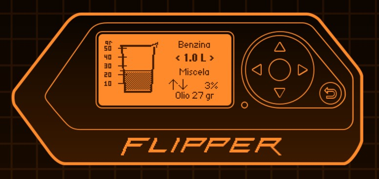

# aMiscela

Two-stroke premix calculator for the Flipper Zero. For the mathematically challenged.

## Screenshot

## Development versions

- Application version: **0.2**
- Flipper Zero API version: **87.1**
- Flipper Zero firmware version: **1.4.3**
- Hardware target: **Flipper Zero (F7)**

The application was developed and compiled using the official Flipper Zero
firmware `1.4.3` and the APIs included with that version.
